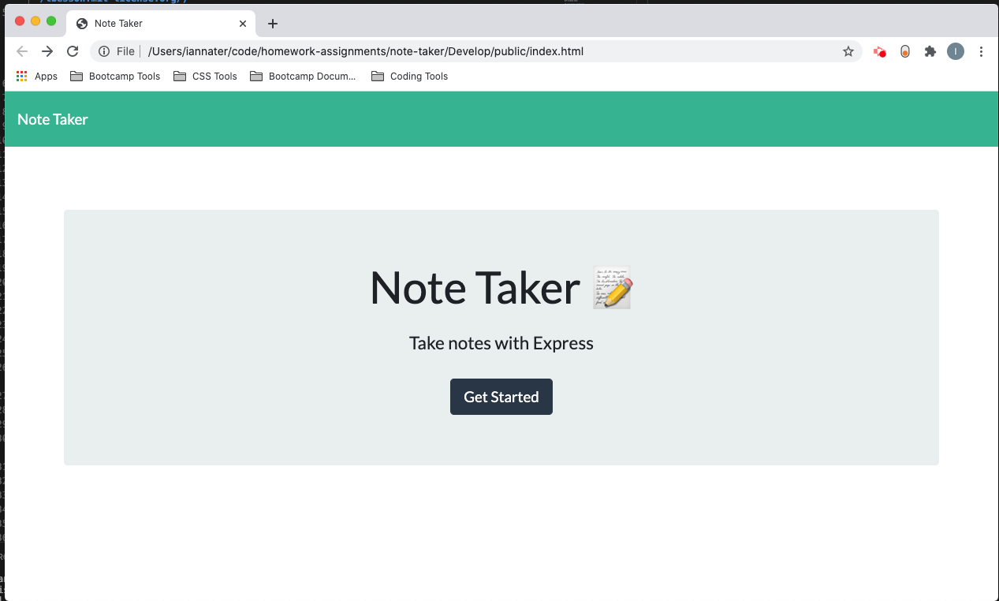

  # Ian's Express Note Taker

  ## Description 
  This application allows you to start a server on your local machine and then run this note taker app. You can create notes that will then be stored into a db.json file. Because they are store in the db.json file they will persist when the app is reloaded. You can delete the notes by clicking on the delete button and this will remove that object from the db file. 

  ## Table of Contents
  [Description](#description) 
  [Installation Instructions](#installation) 
  [Usage](#usage) 
  [Licenses](#license) 
  [Contributor Guidelines](#contributor-guidelines) 
  [Tests](#tests) 
  [Questions](#questions) 

  ## Installation
  npm i

  ## Usage
  1. In your terminal cd into the Develop folder
  2. Start the server by running node server.js
  3. Open Google chrome and and go to localhost:3000
  4. Create note
  5. Fill out a note and save it to the db file in the top right.

  

  ## License
  

  ## Contributor Guidelines
  This is a private project for my coding bootcamp class

  ## Tests 
  Tested this app by making a note, closing and reopening the app, and then deleting the note

  ## Questions
   If you have any questions please contact me via email at ian.nater@gmail.com, you can also follow me on GitHub github.com/iannater

